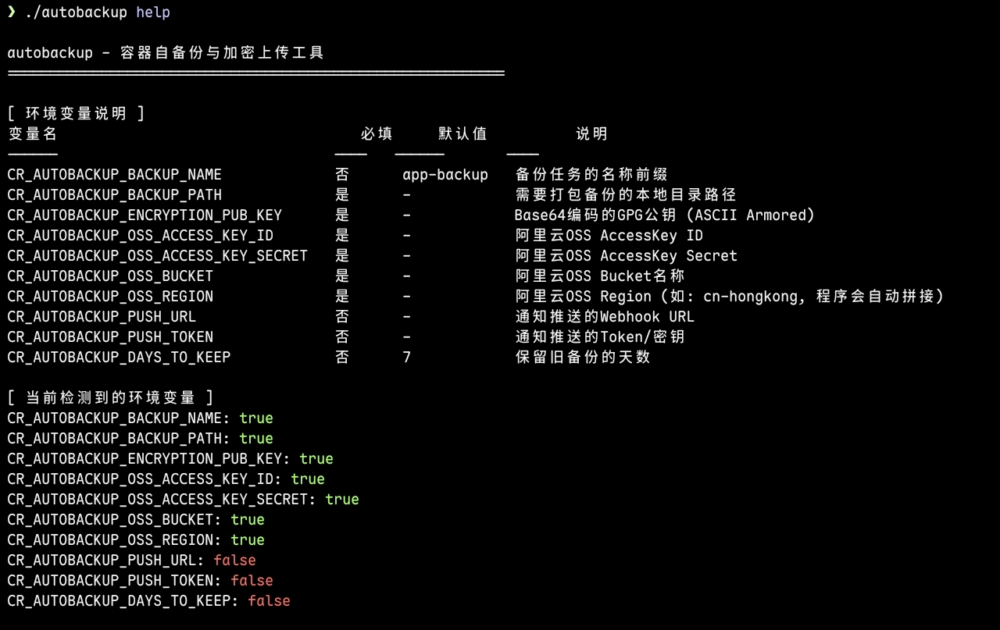

# 使用说明




`CR_AUTOBACKUP_ENCRYPTION_PUB_KEY` 是一个Base64加密变量,解决gpg公钥在环境变量中乱码问题.

获取 `CR_AUTOBACKUP_ENCRYPTION_PUB_KEY`:
```
gpg --armor --output my_pub_key.asc --export "gpg id"
cat my_pub_key.asc | base64 -w 0

```
解密备份文件:
```
gpg --output test.tar.gz --decrypt test.tar.gz.gpg
```
